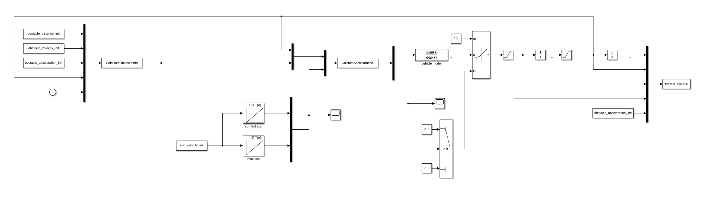

# Speed Plan

A speed planner for ACC.

## 1. PID

## 2. Osqp

A optimal speed planner using OSQP like Apollo。

Cost function:
$$
J = w_a \sum_{i=0}^{n-1} (a_i)^2 + w_j \sum_{i=0}^{n-1} (j_i)^2 + w_v \sum_{i=0}^{n-1} (v_i - v_{ref})^2
    + w_{\varepsilon} \sum_{i=0}^{n-1} (\varepsilon_i)^2
$$
Constraint:
$$
\begin{cases}
a_{i+1} = a_i + j_i \Delta t  \\
v_{i+1} = v_i + a_i \Delta t  + \frac 12 j^2_i \Delta t^2  \\
s_{i+1} = s_i + v_i \Delta t  + \frac 12 a^2_i \Delta t^2 + \frac 16 j^2_i \Delta t^3  \\
s_{i+1} >= s_i  \\
0 \leq s_i \leq s^{obs}_{i}  \\
0 \leq v_i \leq v_{max}  \\
a_{min} \leq a_i \leq a_{max}  \\
j_{min} \leq j_i \leq j_{max}  \\
s^{obs}_{i} - s_i - v_i T_{thw} - d_{res} + \varepsilon_i \geq 0  \\
\varepsilon_i \geq 0
\end{cases}
$$

## 3. Lattice

- Cruising Sample: quartic polynomial.
- Follow Obstacle Sample: quintic polynomial.

Cost:
$$
cost = w_{thw} \times cost^{thw} + w_{com} \times cost^{com} + w_{v} \times cost^{v}
$$

- Cost of THW:

$$
\begin{align}
cost^{thw}_{i} &= 
\begin{cases}
0, & if & s^{obs}_i - s_i \geq v_i T_{thw} + d_{res}  \\
1-\frac{s^{obs}_i - s_i}{v_i T_{thw} + d_{res}}, & if & s^{obs}_i - s_i \leq v_i T_{thw} + d_{res}  \\
\end{cases}

\\

cost^{thw} &= \frac 1n \sum^{n-1}_{i=0} cost^{thw}_{i}

\end{align}
$$

- Cost of Comfortable:

$$
\begin{align}
cost^{com}_{i} &= 
\begin{cases}
\frac{j_i}{j_{min}}, & if & j_i \leq 0  \\
\frac{j_i}{j_{max}}, & if & j_i \geq 0  \\
\end{cases}

\\

cost^{com} &= \frac 1n \sum^{n-1}_{i=0} cost^{com}_{i}

\end{align}
$$

- Cost of speed:

$$
\begin{align}
cost^{v}_{i} &= \frac{|v_i - v_{ref}|}{v_{max}}
\\
cost^{v} &= \frac 1n \sum^{n-1}_{i=0} cost^{v}_{i}

\end{align}
$$